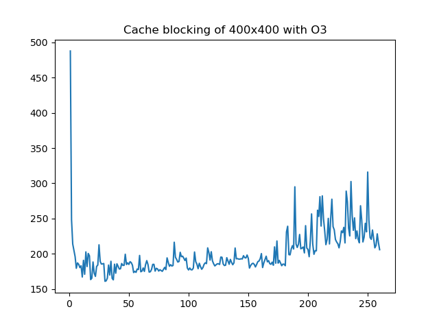

# Notes

## Pre-lesson: Timing Optimisation Strategies

100x100 arrays:

| Optimisation Flags    | Strategy        | Time (ms)
| -------------------   | --------        | ------
| O0                    | Flat array      | 7.70
| O0                    | +Cont. access   | 7.46
| O0                    | +Transpose      | 8.13
| O0                    | +CB, 8          | 9.67
| O0                    | +CB, 16         | 8.65
| -------------------   | --------        | ------
| O1                    | Flat array      | 2.49
| O1                    | +Cont. access   | 4.12
| O1                    | +Transpose      | 4.37
| O1                    | +CB, 8          | 4.47
| O1                    | +CB, 16         | 4.52
| -------------------   | --------        | ------
| O2                    | Flat array      | 1.41
| O2                    | +Cont. access   | 4.77
| O2                    | +Transpose      | 6.44
| O2                    | +CB, 8          | 4.99
| O2                    | +CB, 16         | 5.92
| -------------------   | --------        | ------
| O3                    | Flat array      | 1.15
| O3                    | +Cont. access   | 3.93
| O3                    | +Transpose      | 4.70
| O3                    | +CB, 8          | 4.45
| O3                    | +CB, 16         | 4.19
| -------------------   | --------        | ------
| O3 1000^2 arrs        | Flat array      | 1640
| O3 1000^2 arrs        | +Cont. access   | 2590
| O3 1000^2 arrs        | +Transpose      | 3360
| O3 1000^2 arrs        | +CB, 8          | 2900
| O3 1000^2 arrs        | +CB, 16         | 3030

